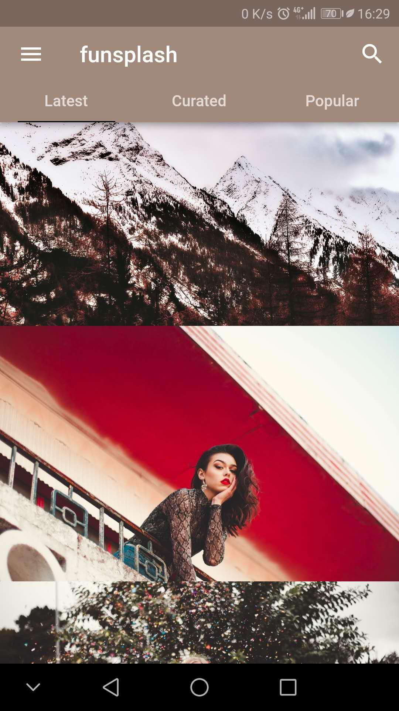
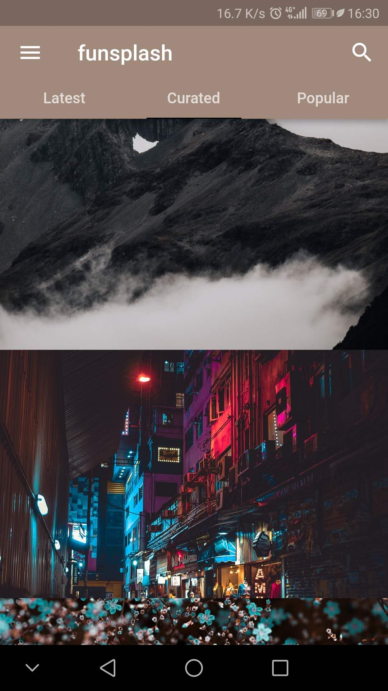
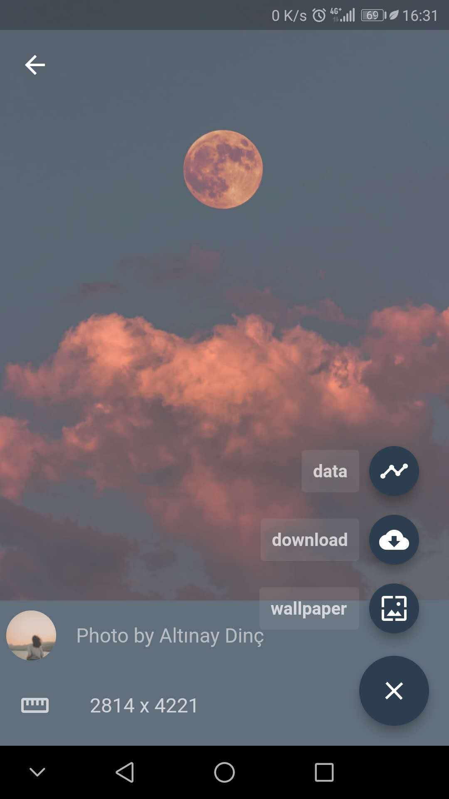
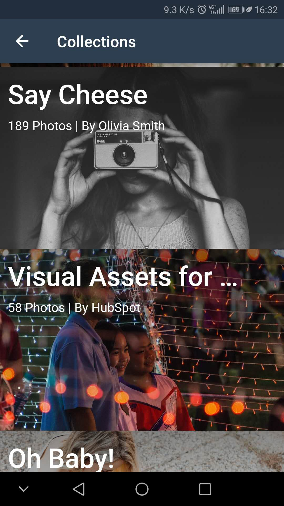
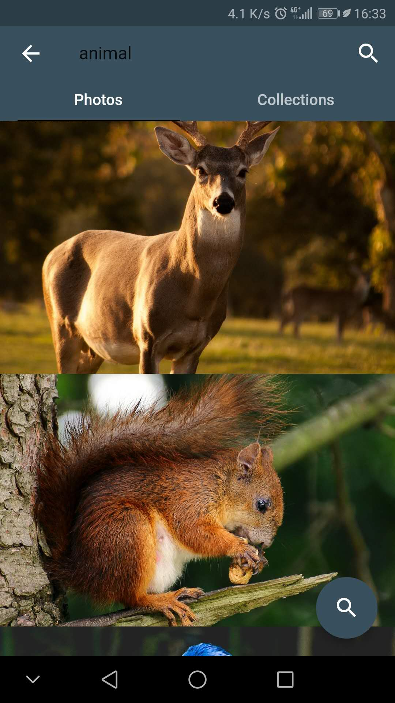

# Funsplash

A simple and open source app written in flutter.  This app comes with a lot of features and a more are coming soon. 

## What's this app
funsplah provides you an easy way to view and get free high-definition pictures, all pictures are from unsplash.

## Available for download


|  [](https://play.google.com/store/apps/details?id=com.qingzhi.funsplash)    |  


## Screenshots

 |   |  
| ------------------------- | ------------------------- | -----------
 |   |  


## Installion

In the command terminal, run the following commands:
```
$ git@github.com:fountainhead-gq/funsplash.git
$ cd funsplash
$ flutter run
```

## TODO

- [ ] Clear Cache
- [ ] Change Language
- [ ] Sign in & register
- [ ] Improve Design
- [ ] Animations
- [ ] ...


## Getting Started

This project is a starting point for a Flutter application.

A few resources to get you started if this is your first Flutter project:

- [Lab: Write your first Flutter app](https://flutter.io/docs/get-started/codelab)
- [Cookbook: Useful Flutter samples](https://flutter.io/docs/cookbook)

For help getting started with Flutter, view our 
[online documentation](https://flutter.io/docs), which offers tutorials, 
samples, guidance on mobile development, and a full API reference.
